# Jarkom-Modul-3-T08-2021

## 7. Luffy dan Zoro berencana menjadikan Skypie sebagai server untuk jual beli kapal yang dimilikinya dengan alamat IP yang tetap dengan IP [prefix IP].3.69 .

### Solusi
Pertama-tama melakukan konfigurasi isc-dhcp-server pada *Jipangu* dengan membuka dan edit file dengan perintah.

```nano /etc/dhcp/dhcpd.conf```

Lalu menambahkan konfigurasi berikut.

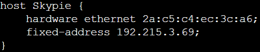

Lalu restart service “isc-dhcp server” pada *Jipangu*. Selanjutnya pada *Skypie* tambahkan konfigurasi seperti dibawah ini dimana hwaddress ether ini untuk mencegah bergantinya hwaddress saat project GNS3 dimatikan atau diexport.

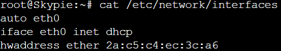

Lalu lakukan restart node *Skypie*.dan periksa ip skypie dengan `ip a`.

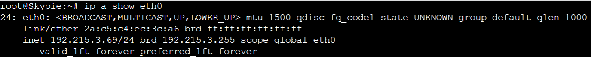


## 8. Loguetown digunakan sebagai client Proxy agar transaksi jual beli dapat terjamin keamanannya, juga untuk mencegah kebocoran data transaksi.Pada Loguetown, proxy harus bisa diakses dengan nama `jualbelikapal.yyy.com` dengan port yang digunakan adalah 5000.

### Solusi
Pada *Water7* melakukan konfigurasi server proxy pada `/etc/squid/squid.conf` dengan memasukan script :

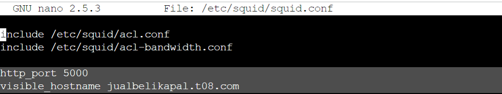

Lalu melakukan `service squid restart`. Selanjutnya pada Loguetown melakukan settingan proxy pada client. Pertama-tama dengan melakukan script berikut : 

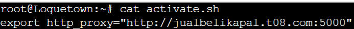

Untuk memeriksa apakah konfigurasi proxy pada client berhasil, silakan lakukan perintah `env | grep -i proxy`. Apabila berhasil, maka environment kita telah berhasil menggunakan proxy.

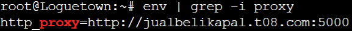


## 9. Agar transaksi jual beli lebih aman dan pengguna website ada dua orang, proxy dipasang autentikasi user proxy dengan enkripsi MD5 dengan dua username, yaitu `luffybelikapalyyy` dengan password `luffy_yyy` dan `zorobelikapalyyy` dengan password `zoro_yyy` 


### Solusi

Buat user dan password baru

`htpasswd -bc /etc/squid/htpasswd luffybelikapalt08`

dengan password 

`luffy_t08`

Buat user dan password baru

`htpasswd -b /etc/squid/htpasswd zorobelikapalt08`

dengan password 

`zoro_t08`


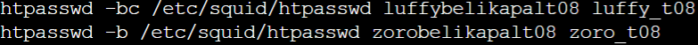

Dapat di cek pada `/etc/squid/htpasswd`

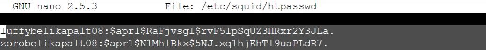

Lalu melakukan config pada `/etc/squid/squid.conf` dengan menambahkan line seperti berikut : 

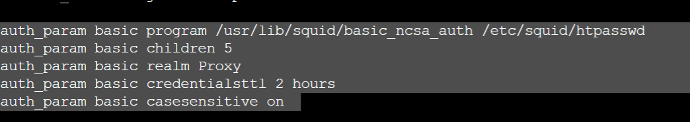

Lalu melakukan `service squid restart`. Dapat terlihat saat melakukan koneksi dibutuhkan autentikasi dari user

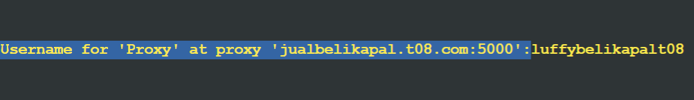


## 10. Transaksi jual beli tidak dilakukan setiap hari, oleh karena itu akses internet dibatasi hanya dapat diakses setiap hari Senin-Kamis pukul 07.00-11.00 dan setiap hari Selasa-Jum’at pukul 17.00-03.00 keesokan harinya (sampai Sabtu pukul 03.00).

### Solusi

Buat file baru bernama `acl.conf` di direktori `/etc/squid`. Lalu isi file tersebut dengan line dibawah ini.

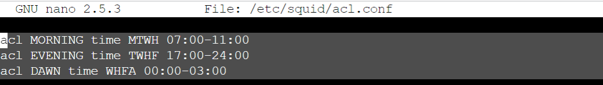

Lalu melakukan config pada `/etc/squid/squid.conf` dengan menambahkan line seperti berikut : 

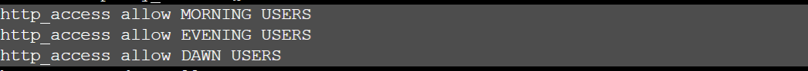

Lalu melakukan `service squid restart`

## 11. Agar transaksi bisa lebih fokus berjalan, maka dilakukan redirect website agar mudah mengingat website transaksi jual beli kapal. Setiap mengakses `google.com`, akan diredirect menuju `super.franky.yyy.com` dengan website yang sama pada soal shift modul 2. Web server `super.franky.yyy.com` berada pada node Skypie.


### Solusi
Pertama-tama melakukan config pada `/etc/squid/squid.conf` dengan menambahkan line seperti berikut :

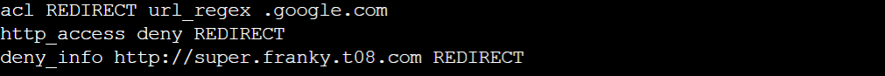

Lalu melakukan `service squid restart`. Selanjutnya mencoba membuka `google.com` dengan lynx pada *Loguetown*.

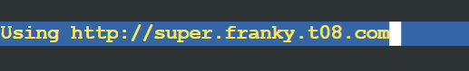

Dapat telihat bahwa website `google.com` akan langsung di redirect ke `super.franky.t08.com`.

## 12. Saatnya berlayar! Luffy dan Zoro akhirnya memutuskan untuk berlayar untuk mencari harta karun di `super.franky.yyy.com`. Tugas pencarian dibagi menjadi dua misi, Luffy bertugas untuk mendapatkan gambar (.png, .jpg), sedangkan Zoro mendapatkan sisanya. Karena Luffy orangnya sangat teliti untuk mencari harta karun, ketika ia berhasil mendapatkan gambar, ia mendapatkan gambar dan melihatnya dengan kecepatan 10 kbps.

### Solusi
Pertama-tama kita membuat sebuah file baru pada `/etc/squid` yaitu `acl-bandiwth.conf`. Dengan isi file seperti dibawah ini.

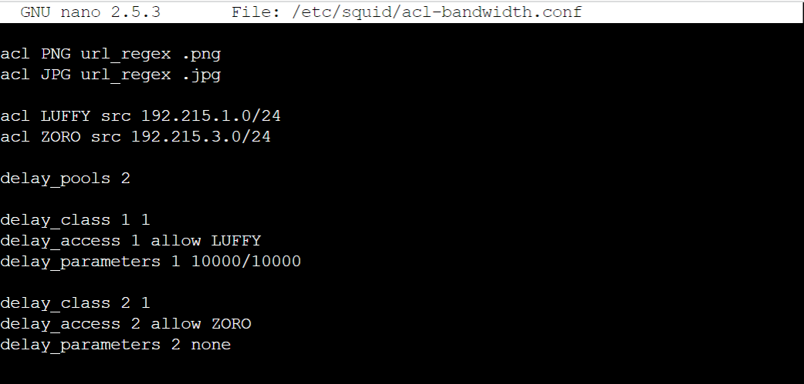

Selanjutnya kita menambah beberapa konfigurasi pada `/etc/squid/squid.conf`. Dapat dilihat beberapa konfigurasi dibawah ini yang berupa.

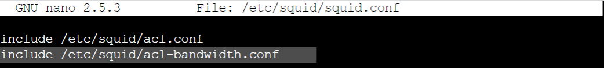

Selanjutnya kita dapat melakukan test pada *loguetown* dan *tottoland* yang dimana kita bagi kedua delay pools. *Loguetown* untuk luffy dan *tottoland* untuk zoro. Dapat dilihat dibawah ini saat kita melakukan test pada area *loguetown*.

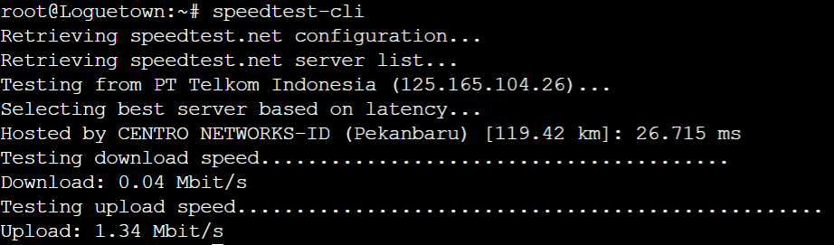

## 13. Sedangkan, Zoro yang sangat bersemangat untuk mencari harta karun, sehingga kecepatan kapal Zoro tidak dibatasi ketika sudah mendapatkan harta yang diinginkannya.

### Solusi
Dengan Konfigurasi pada soal no.12, dapat kita lihat pada delay pools, zoro tidak memiliki pembatasan bandwith sehingga download speednya berjalan dengan normal, berikut merupakan hasil yang didapatkan saat melakukan speedtest pada *tottoland*

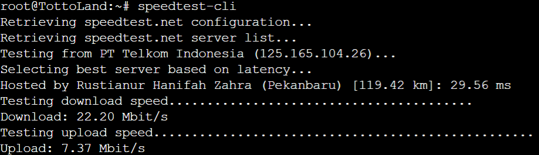
